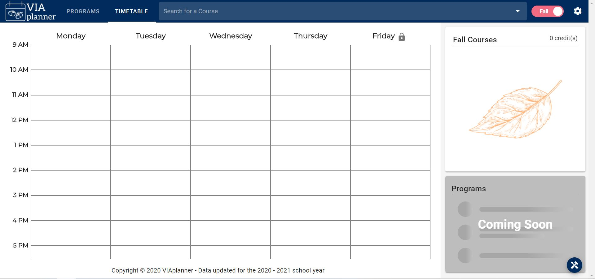

# Timetable Algorithm

A web app that helps UofT students plan their courses by generating a optimal timetable.

The timetable planner allows students to enter their course load and get back a timetable that fits their needs. The functions for the timetable planner are: 
- How early students wish to start and end classes
- What days students would like to take off
- What times students would prefer gap time and breaks
- Preference on the delievery method (if available)

## Overview

User's starting view:

<!--  -->


Once the user selects the courses from the search bar, the course will be added automatically with the first available time under the given constraints:

<!--  -->

The user can choose to lock certain times:

<!--  -->

As well as selecting the delievery method:

<!--  -->

If the course can not be added to the timetable, a message will popup telling the user the selection is unavailable:

 - Invalid:
 
<!--  -->


The timetable will return invalid and displays a message if the constraints are unreachable.


The user can also choose to lock certain course times. 

When preferences are made, those times will not be changed.

<!--  -->

after a course is locked and a preference is being made:too much

<!--  -->

## Roadmap for the Timetable Algorithm
<!---eitheramount  oto reduve therecduvce the computation
- Introduce what the timetable algorithm is for
- Tell a story about the algorithm evo by takinglves
- Have a heading for each optimization in the roadmap
- Start with base conflict check -> invalid times -> idle time max/min -> locked courses
--->
The timetable algorithm takes in a set of course names and transforms into a list of timetables. Then the user can optimize the timetable to fit their preference.

The algorithm starts out by checking if the given sections conflict with each other. The algorithm will return true or false depending on whether or not a conflict exists.

After checking for basic validity, we can optimize our timetable by adding constraints to it.

The algorithm then takes in an invalid time argument that inputs from the user's preference times off. 

The algorithm then implements an idle time function which takes in a set of valid timetable and returns the max and the min idle time depend on the user's preference.

The algorithm then stores the user's locked courses in a list which will stay in position despite future optimization.

### Checking for Conflicts

Before any optimization, the algorithm checks if it is possible to make a timetable out of the given courses by checking the conflict between the course times.

**Pseudocode**
```js
/**
 * 
 * @param timetable: A map of day to timeSections 
 {"MONDAY": [time_sections], ...}
 * 
 */
function overlap(timetable){
    for day in timetable
        if the times of the day overlaps each other
            return false
    return true
}
```

### Times Off

The user can input their desired times off, such as day off or morning/evening off, the algorithm reruns the conflict check and returns valid timetable with the invalid times.

**Psedocode**
```js
/**
 * 
 * @param courseList: A list of course sections 
 {"CSC108H5FLEC0101": {"MONDAY":[Time Section], ...}, ...}
 * @param timesOff: A map of day to TimeSections of times off
 {"MONDAY":[Time Sections], ...} 
 *
 */
function bucketCourseByDay(courseList, timesOff){

    for course in courseList
        append course to timetable
    for timesOffBlock in timesOff
        append timesOffBlock to timetable
    check if valid or not by overlap function

}
```


### Maximize or Minimize Idle Time

The user can choose to maximize or minimize their idle time at school, which is the time gaps between classes each day. The algorithm compares the total idle time in each timetable given and returns the user's preference.

**Pseudocode**

```js
/**
 * 
 * @param setTimetable: A list of timetable
 [{"MONDAY":[Time Sections], ...}]
 * @param maxOrMin: A string 
 "MAX"/"MIN"
 *
 */
function idleTime(setTimetable, maxOrMin){

    for timetable in setTimetable
        sum up all the idle time and store the index
    check for the max and min of the idletimes
    return based on maxOrMin

}
```

### Locked Time Sections

The user can lock the section(s) they prefer to stay the same while processing other optimizations. The algorithm stores the locked section in a list, when processing other optimization, the list is being compared and put in to the new timetable to ensure timetable includes the locked section.


