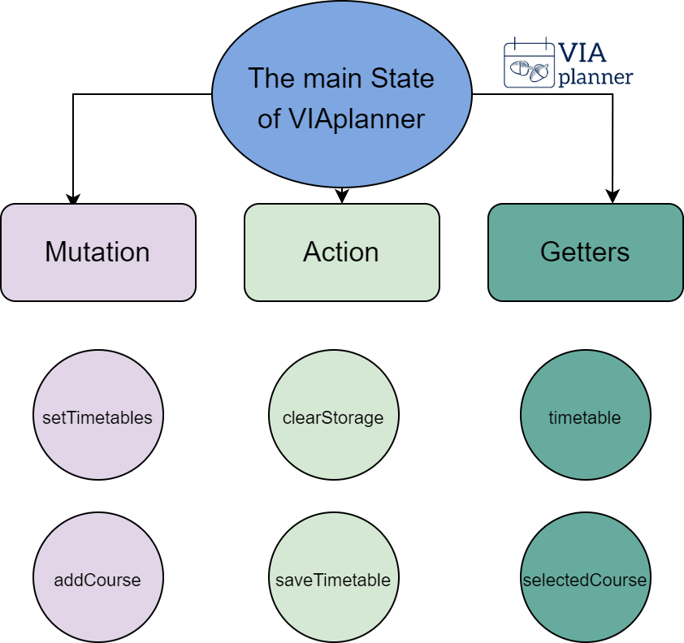

# State Management

The state management is a crucial part for any web-development, as it involves the control of different web state when interact. A badly managed web state can lead development more difficult as the complication increases, a good one is the opposite. Luckily we are able to use a native tool from the framework VUE.

## VUEX

Vuex is a state management pattern + library for Vue.js applications. It serves as a centralized store for all the components in an application, with rules ensuring that the state can only be mutated in a predictable fashion. It also integrates with Vue's official devtools extension to provide advanced features such as zero-config time-travel debugging and state snapshot export / import.

For more information click [here](https://vuex.vuejs.org/)

## VUEX in VIAplanner

VUEX is mainly constructed with one main state with three method to interacted with the main state.


## Main State

The main state is the core dependency of VIAplanner, any changes to the main state will directly reflect by VIAplanner. The design pattern of VUEX is similar to the singleton design pattern, where we only keep one copy of the data to ensure the simplicity to maintain the in the change of states.

### fallLockedHourStatus
The following example is part of the main state. It is used to reflect the locked status for fall semester for the [algorithm](/via-timetable/algorithm/) to check when render.
``` js
type fallLockedHourStatus {
    fallLockedHourStatus: !localStorage.fallLockedHourStatus ? {
        "8 AM": false,
        "9 AM": false,
        "10 AM": false,
        "11 AM": false,
        "12 PM": false,
        "1 PM": false,
        "2 PM": false,
        "3 PM": false,
        "4 PM": false,
        "5 PM": false,
        "6 PM": false,
        "7 PM": false,
        "8 PM": false,
        "9 PM": false,
    } : JSON.parse(localStorage.fallLockedHourStatus)
}
```

### fallTimetable
Another example is the fallTimetable, it is the used to reflect the state of what courses is in the fall semester. Since UofT students' timetable are all repetitive every week, we can simply use one week to represent the entire semester for any students. Futhermore, committing changes this state will directly affect the what courses will show on the fall semester timetable.

``` js
type fallTimetable {
    fallTimetable: !localStorage.fallTimetable ? {
        MONDAY: [],
        TUESDAY: [],
        WEDNESDAY: [],
        THURSDAY: [],
        FRIDAY: [],
    } : JSON.parse(localStorage.fallTimetable)
}
```

## Mutations

Mutation is a very important part for the change in between states. Mutation is responsible for the final step during the process of changing states, as it mutate the value of the main state.

### setTimetables
The following example shows how the fall timetable and winter timetable is mutated with the parameter that carries a new fall and winter timetable.

``` js
type setTimetables(state, payload) {
    state.fallTimetable = payload[0];
    state.winterTimetable = payload[1];
}
```

## Actions

Action is a complement action with mutation when making changes to the main state, it can execute multiple mutations in the same time. Most importantly it allows you to put down logics to judge which mutation to execute

### saveLockedHourStatus
The following example is a demonstration of a simple action that execute two changes to the main state with a if statement to judge the wanted statement.

``` js
type saveLockedHourStatus(context) {

    if (context.state.semesterStatus === "F") {
        context.state.savedLockedHourStatus = JSON.parse(
            JSON.stringify(context.state.fallLockedHourStatus))
    } else {
        context.state.savedLockedHourStatus = JSON.parse(
            JSON.stringify(context.state.winterLockedHourStatus))
    }

}
```

## Getters

Getter is a different method compare to mutation and action, it doesn't change any value of the main state, but it obtain specific information from the main state.

### timetable
Obtain the current timetable based on the current semester.
``` js
type timetable(state) {
    if (state.semesterStatus === "F") {
        return state.fallTimetable;
    } else {
        return state.winterTimetable;
    }
}
```
